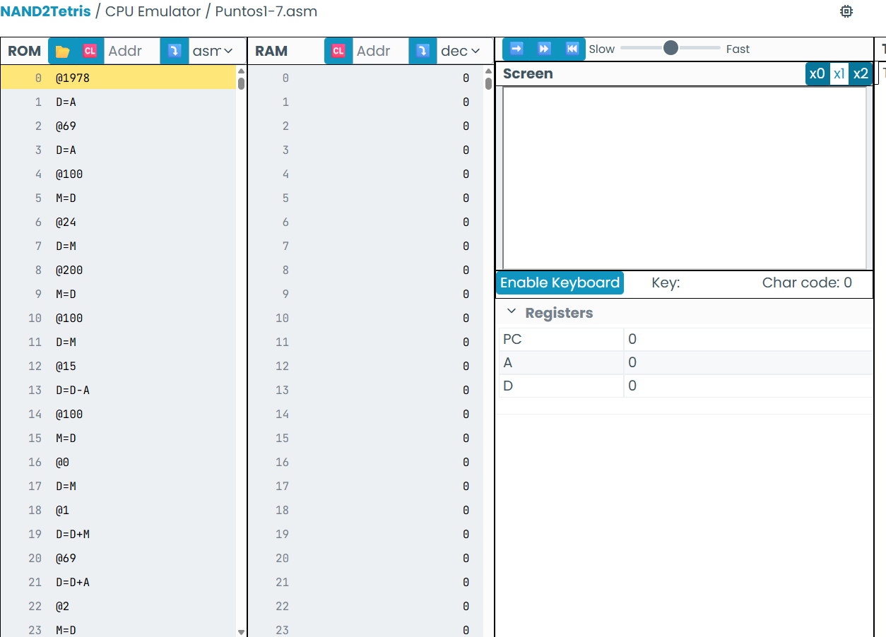
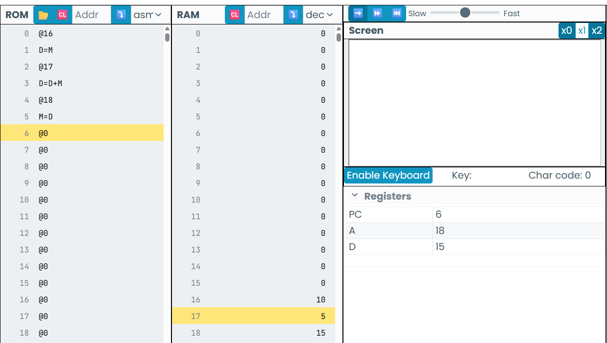
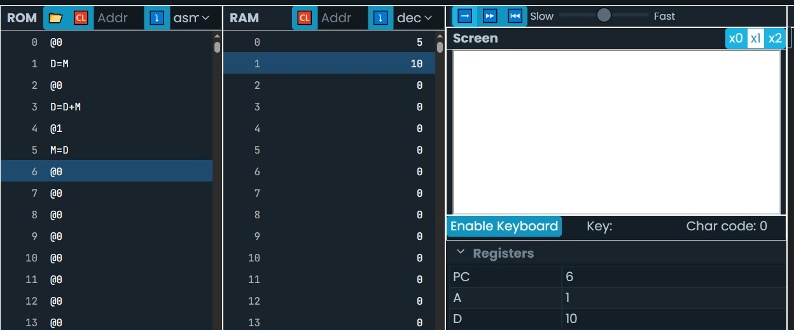
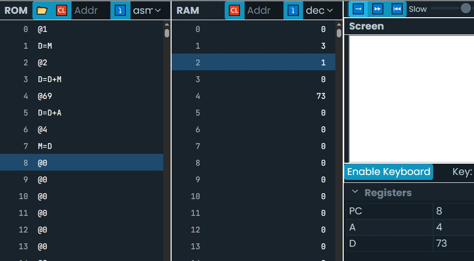
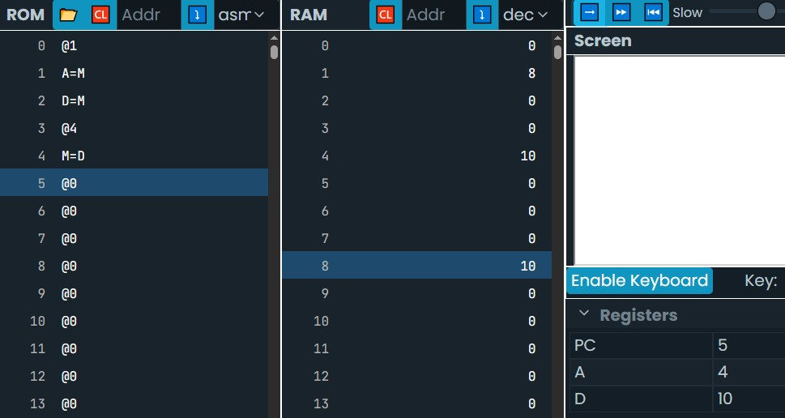
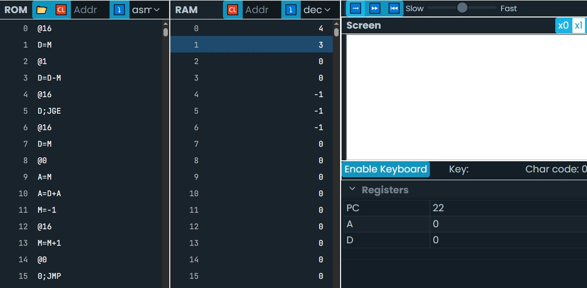
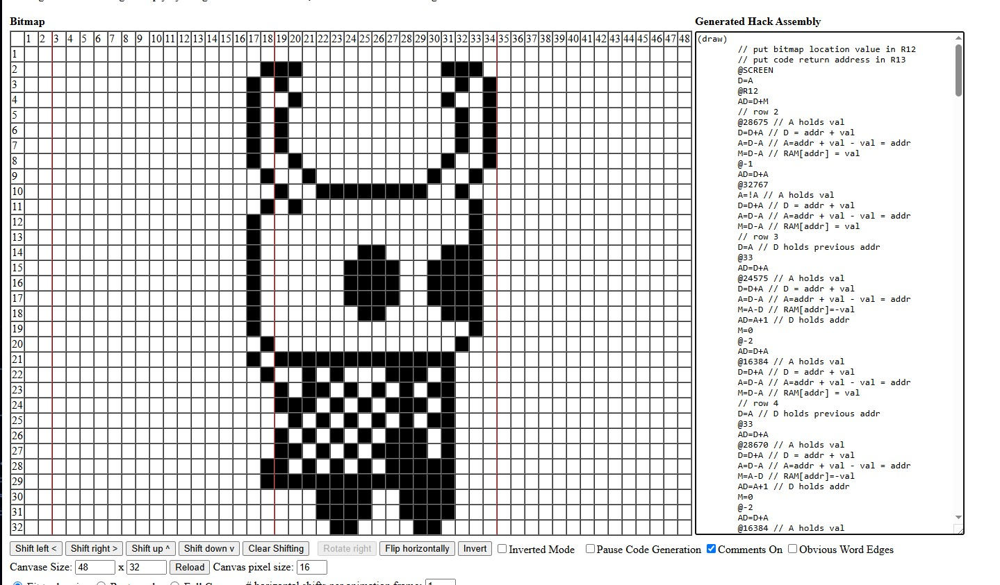

Puntos 1 al 7: Aprendi a manejar los registros, guardar valores en la Ram y realizar operaciones para cambiar los registros o  valores de las posiciones en la Ram. Utilice el CPU emulator para corroborar que si funcionaba los pasos escritos.

 [alt text](Conclusiones.md)

PUNTO 8

- ¿Qué hace este programa?
R/ El programa  suma var1 y var2 y guarda el resultado en var3.

- En qué posición de la memoria está `var1`, `var2` y `var3`? ¿Por qué en esas posiciones?
R/ Var1 estaría en la pos 16, ya que seria la primer variable creada y los valores antes de 15 son valores ya reservados para el programa, luego var 2 estaría en la pos 17 y var 3 en la pos 18.

PUNTO 9

- ¿Qué hace este programa?
R/ Crea una variable i en la pos 16 en la que se le asigna a la ram el valor 1, luego se crea otra variable sum en la pos 17 en la que se le asigna el valor 0, luego a sum se le asigna el valor de la suma de sum y i, por último a la var i se le suma un 1 y se guarda en la ram.

- ¿En qué parte de la memoria RAM está la variable `i` y `sum`? ¿Por qué en esas posiciones?

R/ i estaría en la pos 16, ya que seria la primer variable creada y sum en la pos 17 ya que seria la segunda creada y cada vez que se crea una nueva variable es a partir de la pos 16 y asi sucesivamente.

//Parte Optimizada:
@i
M=+1

No es necesario poner la suma en D debido a que solo le vamos a sumar un 1 al valor que esta en la i y esa instruccion si existe en el programa.

PUNTO 10

Como la multiplicacion no existe como instruccion en el programa y tenia que multiplicar por 2, lo que hice fue sumar 2 veces lo que está guardado en R0 que en este caso fue un 5 para que me diera 10 y de esta se habría realizado la multiplicacion por 2 y luego guardarlo en R1.

PUNTO 11

    - ¿Qué hace este programa?
    R/ Este programa es una cuenta regresiva desde 1000 hasta 0 usando una variable llamada i,Guarda 1000 en la variable i ,luego entra en un bucle (LOOP) que verifica si i es 0, Si lo es, salta a CONT y termina el bucle. Si no, resta 1 a i y vuelve a empezar.

    - ¿En qué memoria está almacenada la variable i? ¿En qué dirección de esa memoria?
    R/ i estaría en la pos de la ram 16, ya que seria la primer variable creada.

    - ¿En qué memoria y en qué dirección de memoria está almacenado el  i = 1000?
    R/ en la ram en la pos 16 ya que se le asigno el valor a la variable i que tiene pos 16 en la ram.

    - ¿Cuál es la primera instrucción del programa anterior? ¿En qué memoria y en qué dirección de memoria está almacenada esa instrucción?
    R/ el primer paso es @1000 yse guarda en la memoria rom ya que es una instruccion a ejecutarse y se guarda en la dirección 0 por ser el primer paso.

    - ¿Qué son CONT y LOOP?
    R/ cont y loop son etiquetas para poder identificar que parte el programa hace loop y en que parte continua con el proceso si el bucle acaba, esto con el fin de facilitar en que parte especifica es uno de los dos caso sin necesidad de volver a contar cada paso para saber donde es, en este caso loop estariá en la pos 4 y cont en la 12.

    - ¿Cuál es la diferencia entre los símbolos `i` y `CONT`?
    R/ la diferencia es que i es una variable que almacena un dato en la posicion de la ram que se le asigno y cont una etiqueta que representa una posicion en el program de la rom donde se puede hacer un salto.

    PUNTO 12

    R/ Para este ejercicio en la R1 guarde el valor 3, en R2 guarde el valor 1 y a la hora de guardar el resultado en R4 me dio la suma de R1+R2+69 = 73
    

   PUNTO 13

   R/Para este ejercicio guarde el valor 4 en R1 para hacer que si R0 es mayor que 0 o igual a 1 que realizara un salto donde tengo la etiqueta JUMP para despues asignar el valor 1 a R1, en caso que R0 no cumpla el condicional no realiza el salto y pone el valor -1 en R1 para despues realizar un salto a la etiqueta end para que no realice ningun otro paso al no cumplir la condicion.

   PUNTO 14

   R/ Me di cuenta que R4 = RAM[R1] no es igual a RAM[R4]= RAM[R1], ya que lo primero te dice que el valor guardado en R1 lo asignes en R4, en cambio lo que dice el ejercicio es que el valor de R1 se tiene que usar como  direccion, ir a esa direccion y guardar ese valor en R4. Entonces en este ejercicio que el valor en R1 se guarde en A para ir a esa dirección y ahí si guardar el valor en R4. En este caso el valor en R1 fue 8 y en R8 puse 10 para probar el programa.

   

   PUNTO 15

   R/ cree una  variable i con valor 0 para que sea el contador,luego cree un loop donde cada vez que se realiza el paso se verifica si i ha alcanzado el tamaño de la región R1. Si ya lo alcanzó, salta a END y termina el programa. Si no, a i se le suma la direccion de R0 para que almacene en esa direccion el valor -1. Después incrementa i en 1 y se repite hasta que se cumpla el tamaño de la region en R1. En el ejercicio R0 que es la region inicial, puse el valor de 4 y en R1 que es el tamaño de la region puse 3, asi que como resultado el -1 se puso en R4,R5 y R6.

   

   PUNTO 16
- ¿Qué hace este programa?
R/ Crea un arreglo de 10 enteros llamado arr, recorre el arreglo 10 veces hasta que se completa el bucle, suma el valor de arr[j] a sum y como resultado sum contiene la suma de los 10 elementos del arreglo arr.

- ¿Cuál es la dirección base de arr en la memoria RAM?
R/ Si arr es la primera variable ocuparia de base la RAM 16, pero podria posicionarse en otra direccion dependiendo el numero de variables puestas en el programa, pero para el ejercicio el valor que esta en la ram es la direccion en la que estaría el rango del arreglo

- ¿Cuál es la dirección base de sum en la memoria RAM y por qué?
R/Para este ejercicio la dirección base de sum es 18

- ¿Cuál es la dirección base de j en la memoria RAM y por qué?
R/ j esta en la direccion 16, ya que es la primera variable creada en el programa.

PUNTO 17
R/ Para realizar un condicional con de restando o sumando algo, primero tengo que ingresar el valor con el que voy a realizar la comparacion y luego si restarlo a D. Antes de realizar el salto se escribe en rom el la direccion a la que va a ir si se cumple el condicional. Realice solo la condicion, pero tambien probe cuando la condicion se cumple en el programa para corroborar de que si salta a la direccion 69.

PUNTO 18

Este fue el bitmap que realice:

PUNTO 19

R/ Prepara la pantalla para recibir un valor del teclado

PUNTO 20

R/