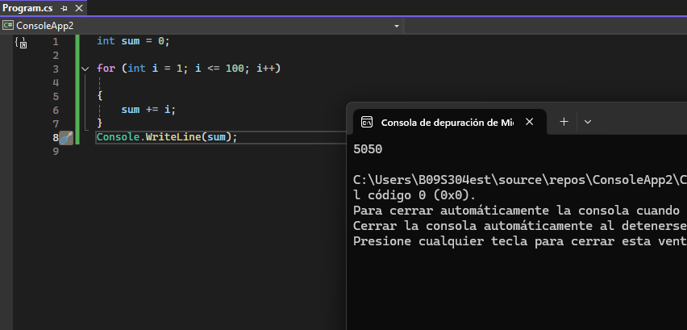
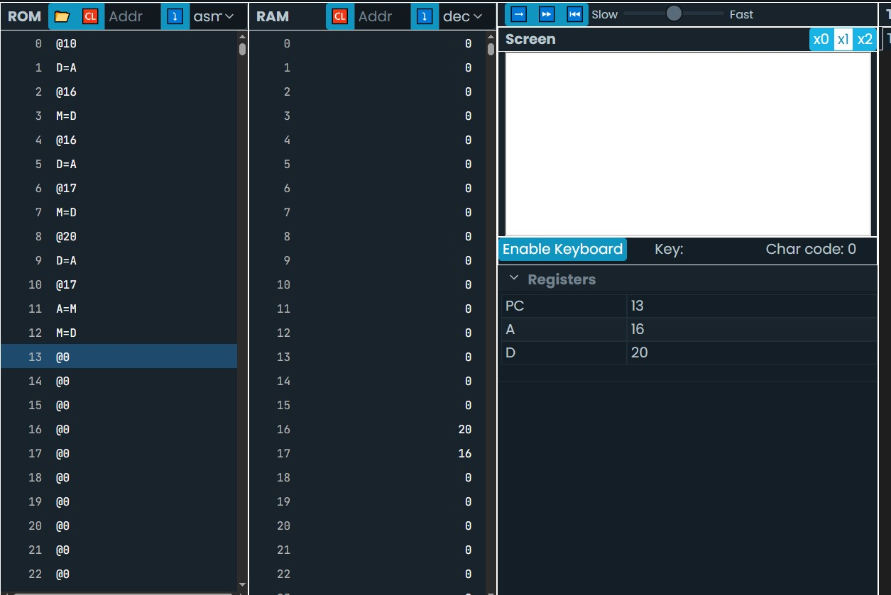
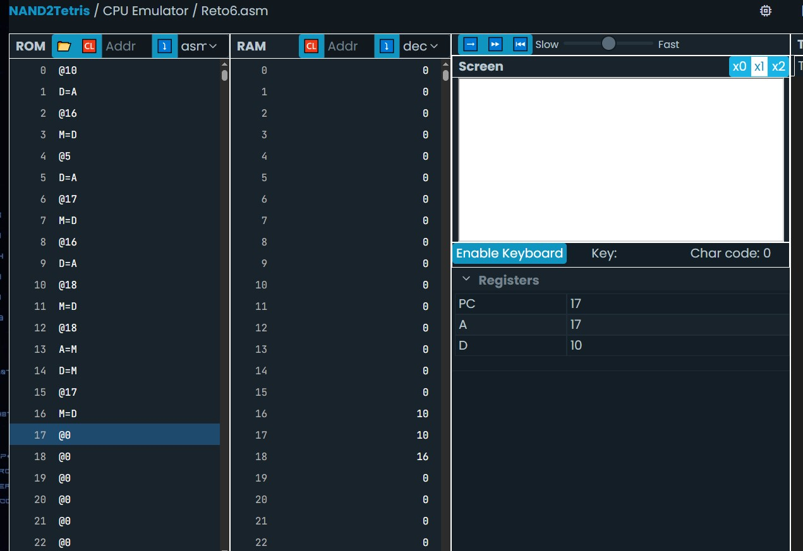

### Actividad 1

1. Escribe un programa en lenguaje ensamblador que sume los primeros 100 números naturales.

    ```cpp
    int i = 1;
    int sum = 0;
    While (i <= 100){
       sum += i;
       i++;
    }
    ```
    <video controls src="Reto1.mp4" title="Title"></video>

    - ¿Cómo están implementadas las variables `i` y `sum`?

      R/ en este programa i es el contador y a su vez es el valor que se le va a sumar a la variable sum hasta que i sea mayor a 100. Por otro lado, sum es la variable va sumando i en el ciclo y guardando ese resultado en la dirección que tiene.

    - ¿En qué direcciones de memoria están estas variables?

      R/ La variable i está en la dirección 16 es la primera variable en crearse y sum en la pos 17 ya que es la segunda en crearse.

    - ¿Cómo está implementado el ciclo `while`?

      R/ En el programa el while se llama mientras que i sea menor que 101, si es 101 se deja de llamar el bucle y  continua el programa.

    - ¿Cómo se implementa la variable `i`?

      R/ en este caso con @i y en este programa cumple la funcion de ser contador y su valor se suma.

    - ¿En qué parte de la memoria se almacena la variable `i`?

      R/ Se almacena en la memoria RAM y en este programa sería en la dirección 16 por ser la primera variable

    - Después de todo lo que has hecho, ¿Qué es entonces una variable?

      R/ Una variable es una dirección de memoria que tiene una pos fija en la RAM dependiendo en que orden fue creada

    - ¿Qué es la dirección de una variable?

      R/ La dirección es la pos de memoria en la que se encuentra esa variable.

    - ¿Qué es el contenido de una variable?

      R/ El contenido es el valor que está guardado en esa variable

  ### Actividad 2

    Transforma el programa en alto nivel anterior para que utilice un ciclo for en vez de un ciclo while.

    El ciclo for contiene una variable de inicializacion y contador normalmente nombrada i, luego la condicion que en este caso seria  i <= 100 y sumarle 1 al contador para que el ciclo continue hasta que la condicion termine.
    


  ### Actividad 3

    Escribe un programa en lenguaje ensamblador que implemente el programa anterior.

    R/ Es casi igual a la actividad 1, solo que la diferencia es más la estructura que tiene el while y el for en alt nivel, ya que en el for se inicializa el i = 1 y luego se hacen las condiciones y siempre tiene la misma estructura, aunque es mas usado para casos en los que se sabe cuantas veces va a recorrerse el ciclo. En cambio, el while  se basa más en la condicion que lleva para recorrerse sin inicializarse en el mismo bucle, aunque, en este ejercicio en ambos codigos de bajo nivel se obtiene el mismo resultado.


  ### Actividad 4

- ¿Cómo se declara un puntero en C++? `int *punt;`. `punt` es una variable que almacenará la dirección de un variable que almacena enteros.

    R/ Se declara usando el asterisco * junto al tipo de dato.

- ¿Cómo se define un puntero en C++? 
`punt = &var;`. Definir el puntero es inicializar el valor del puntero, es decir, guardar la dirección de una variable. En este caso `punt` contendrá la dirección de `var` .

    R/ Definir un puntero significa asignarle la dirección de una variable existente. Esto se hace con el operador &, que obtiene la dirección de una variable. punt = &var; le dice al puntero punt que ahora apunte a la dirección de var.

- ¿Cómo se almacena en C++ la dirección de memoria de una variable? Con el operador `&`. `punt = &var;`

    R/ Se usa el operador & antes del nombre de la variable. Por ejemplo, &var devuelve la dirección de memoria donde está guardado var. Esta dirección se puede guardar en un puntero, como en punt = &var;.


- ¿Cómo se escribe el contenido de la variable a la que apunta un puntero? Con el operador . `punt = 20;`. En este caso 
como `punt` contiene la dirección de `var`  entonces `punt` a la izquierda del igual indica que quieres actualizar el valor de la variable `var`

R/ Para acceder o modificar el valor de la variable apuntada, se utiliza el operador *

### Actividad 5

Traduce este programa a lenguaje ensamblador:

```cs
int var = 10;
int *punt;
punt = &var;
*punt = 20;

```
R/ Primero se le asigna el valor 10 a var, luego se crea un puntero que para crearlo tengo que guardar la direccion de var en PUNT, entonces si yo quiero un valor a la direccion del puntero, guardo M en A y luego el valor o la operacion que quiera realizar para guardar un valor en esa direccion a la que apunta el puntero.



### Actividad 6

6. Ahora vas a usar un puntero para leer la posición de memoria a la que este apunta, es decir, vas a leer por medio del puntero la variable cuya dirección está almacenada en él.
    
    ```cpp
    int var = 10;
    int bis = 5;
    int *p_var;
    p_var = &var;
    bis = *p_var;
    ```
    
    En este caso `bis = *p_var;` hace que el valor de `bis` cambie de 5 a 10 porque `p_var` apunta a la la variable `var` y con `*p_var` a la derecha del igual estás leyendo el contenido de la variable apuntada.

 R/En este caso nos dice que tenemos que guardar el valor que esta en la direccion que apunta el puntero y guardarlo en la variable bis.


 ### Actividad 7

 R/ se guarda 10 en var, se guarda 5 en bis y se guarda la direccion de var en PUNT, luego se guarda el valor de la direccion al que apunta el puntero y lo guarda en bis, osea apunta a la direccion var, toma ese valor que tiene guardado var en este caso 10 y lo guarda en bis.

 


 ### Actividad 8

 8. Vas a parar un momento y tratarás de recodar de memoria lo siguiente. Luego verifica con un compañero o con el profesor.

    - ¿Qué hace esto `int *pvar;`?

      R/ Lo que hace es que crea la variable puntero para var

    - ¿Qué hace esto `pvar =  var;`? 

      R/ Guarda el valor de la RAM que tiene var en el puntero

    - ¿Qué hace esto `var2 = *pvar`?

      R/ El puntero fija como direccion la que tiene guardada, va a esa direccion, saca el valor que hay en esa direccion y lo guarda en la variable var2.

    - ¿Qué hace esto `pvar = &var3`?

      R/  Guarda la direccion de var en el puntero