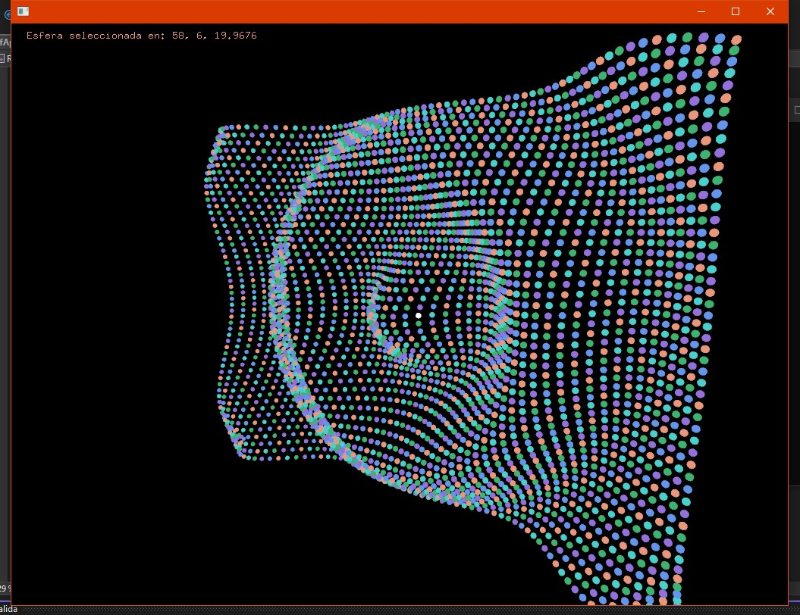

- Codigo .h

```cpp

#pragma once

#include "ofMain.h"


class ofApp : public ofBaseApp {

public:
	void setup();
	void update();
	void draw();


	void generateSpheres();
	void mousePressed(int x, int y, int button);
	void keyPressed(int key);
	//void mouseReleased(int x, int y, int button);

	void convertMouseToRay(int mouseX, int mouseY, glm::vec3& rayStart, glm::vec3& rayEnd);

	bool rayIntersectsSphere(const glm::vec3& rayStart, const glm::vec3& rayDir, const glm::vec3& sphereCenter, float sphereRadius, glm::vec3& intersectionPoint);


private:

	float distDiv = 45.5;
	float amplitud = 50;


	int xStep = 15;
	int yStep = 15;

	int mouseX;
	int mouseY;

	std::vector<glm::vec3> spherePositions;

	bool sphereSelected;

	glm::vec3* selectedSpherePosition = nullptr;


	ofEasyCam cam;

};


```


- Codigo .cpp

```cpp

#include "ofApp.h"

//--------------------------------------------------------------
void ofApp::setup() {


	spherePositions.clear();
	generateSpheres();

}

//--------------------------------------------------------------
void ofApp::update() {


}

//--------------------------------------------------------------
void ofApp::draw() {

	vector<ofColor> palette = {
		
		ofColor(100, 149, 237), // Azul suave (Cornflower Blue)
		ofColor(60, 179, 113), // Verde medio
		ofColor(233, 150, 122), // Rojo coral suave
		ofColor(147, 112, 219), // Violeta pastel
		ofColor(72, 209, 204) // Turquesa
	};

	ofBackground(0);
	cam.begin();

	for (int i = 0; i < spherePositions.size(); i++) {
		auto & pos = spherePositions[i];

		if (sphereSelected && pos == *selectedSpherePosition) {
			ofSetColor(255); // seleccionada = blanca
		} else {
			ofSetColor(palette[i % palette.size()]);
		}
		ofDrawSphere(pos, 5);
	}

	cam.end();

	if (sphereSelected) {

		ofDrawBitmapString("Esfera seleccionada en: " + ofToString(*selectedSpherePosition), 20, 20);
	}

	
}

void ofApp::generateSpheres() {
	spherePositions.clear();
	for (int x = -ofGetWidth() / 2; x < ofGetWidth() / 2; x += xStep) {
		for (int y = -ofGetHeight() / 2; y < ofGetHeight() / 2; y += yStep) {
			float z = cos(ofDist(x, y, 0, 0) / distDiv) * amplitud;
			spherePositions.push_back(glm::vec3(x, y, z));
		}
	}
}

void ofApp::mousePressed(int x, int y, int button) {
	// Convertir las coordenadas del mouse en un rayo 3D
	glm::vec3 rayStart, rayEnd;
	convertMouseToRay(x, y, rayStart, rayEnd);


	// Comprobar si el rayo intersecta alguna esfera
	sphereSelected = false;


	for (auto& pos : spherePositions) {
		glm::vec3 intersectionPoint;

		if (rayIntersectsSphere(rayStart, rayEnd - rayStart, pos, 7.0, intersectionPoint)) {
			// EN ESTA PARTE Debes adicionar la lógica para indicarle
			// a la aplicación la esfera seleccionada.


			sphereSelected = true;
			selectedSpherePosition = &pos;

		
			//printf("a(%.2f,%.2f, %.2f)\n", pos.x, pos.y, pos.z);
		}
	}
}

void ofApp::convertMouseToRay(int mouseX, int mouseY, glm::vec3& rayStart, glm::vec3& rayEnd) {
	// Obtener matrices de proyección y modelo/vista de la cámara
	glm::mat4 modelview = cam.getModelViewMatrix();
	glm::mat4 projection = cam.getProjectionMatrix();
	ofRectangle viewport = ofGetCurrentViewport();

	// Convertir coordenadas del mouse a Normalized Device Coordinates (NDC)
	float x = 2.0f * (mouseX - viewport.x) / viewport.width - 1.0f;
	float y = 1.0f - 2.0f * (mouseY - viewport.y) / viewport.height;

	// Crear el rayo en NDC
	glm::vec4 rayStartNDC(x, y, -1.0f, 1.0f); // Near plane
	glm::vec4 rayEndNDC(x, y, 1.0f, 1.0f); // Far plane

	// Convertir a coordenadas mundiales
	glm::vec4 rayStartWorld = glm::inverse(projection * modelview) * rayStartNDC;
	glm::vec4 rayEndWorld = glm::inverse(projection * modelview) * rayEndNDC;

	rayStartWorld /= rayStartWorld.w;
	rayEndWorld /= rayEndWorld.w;

	rayStart = glm::vec3(rayStartWorld);
	rayEnd = glm::vec3(rayEndWorld);
}

// Detectar si el rayo intersecta una esfera
bool ofApp::rayIntersectsSphere(const glm::vec3& rayStart, const glm::vec3& rayDir, const glm::vec3& sphereCenter, float sphereRadius, glm::vec3& intersectionPoint) {
	glm::vec3 oc = rayStart - sphereCenter;

	float a = glm::dot(rayDir, rayDir);
	float b = 2.0f * glm::dot(oc, rayDir);
	float c = glm::dot(oc, oc) - sphereRadius * sphereRadius;

	float discriminant = b * b - 4 * a * c;

	if (discriminant < 0) {
		return false;
	}
	else {
		float t = (-b - sqrt(discriminant)) / (2.0f * a);
		intersectionPoint = rayStart + t * rayDir;
		return true;
	}
}

void ofApp::keyPressed(int key) {
	switch (key) {
	case 'w': // Disminuye yStep
		yStep = std::max(10, yStep - 5);
		generateSpheres();
		break;
	case 's': // Aumenta yStep
		yStep += 5;
		generateSpheres();
		break;
	case 'a':  // Disminuye xStep
		xStep = std::max(10, xStep - 5);
		generateSpheres();
		break;
	case 'd': //Aumentar xStep
		xStep += 5;
		generateSpheres();
		break;
	case 'q': // disminuir amplitud 
		amplitud = std::max(10.0f, amplitud - 5.0f);
		generateSpheres();
		break;
	case 'e': // aumentar amplitud 
		amplitud += 5.0f;
		generateSpheres();
		break;
	}
}

```

# Evidencias y conclusiones

- Resultado





## Codigo.h

R/ En el .h cree diferentes variables para poder cambiar las variables a la hora de realizar código como xStep, yStep, distDiv y amplitud, las demas ls fui agregando mientras miraba lo que tocaba realizar en el reto me iba danto cuento respecto a los métodos si tenia que agregar algún tipo de variable.

Una variable que agregue fue :
```cpp 
glm::vec3* selectedSpherePosition = nullptr
```
Que fue un puntero que cree con el fin de saber la direccion de la esfera que esta seleccionada, la agregue en el metodo de que al hacer click seleccione la esfera y se me hiz una forma sencilla de hacer que funcione ya que la pos la desreferencio y guardo en el vector esa direccion de esfera y ya en el draw termino de realizar la logica que cambie de color cuando se presiona y diga las coordenadas. Al inicio lo trate de hacer sin esto, pero se me complicaba mucho al hacerlo y de esta forma funciono intermitentemente dependiendo de cierta perspectiva, pero no era culpa del codigo sino de la misma camara.

Lo que paso fue que mi  cam se inicializaba con una perspectiva diferente a la usual, no aparecia centrada y eso causaba errores en como se posicionaba el rayo que se crea en la pos del mouse tocara una esfera, hacia que no funcionara bien, cuando el profe se percato, me dijo que revisara que salia diferente y cuando quite ese pequeño set up que tenia de la perspectiva de la camara funciono sin ningun tipo de problema seleccionar la esfera y estaba dando vueltas porque no funcionaba y era algo muy sencillo, asi que si habria funcionado sin la var de puntero tendria que probar a ver, ya con la camara arreglada, porque como funciono con el puntero no vi la necesidad.


## codigo.cpp

R/ En el set up tengo, puse que se borraran las esferas del vector  y llamar a la funcion generateSpheres que es la encarga de hacer como la tabla de esferas con la distancia que va a tener cada una y como se van a generar y cuantas gracias a la distancia entre ellas, al inicio tenia todo el codigo en el set up, pero decidi que era mejor ponerlo como método, ya que así puedo llamarlo cuando lo necesite y ese cambio lo hice para poder hacer que cuando se presionara una tecla procurara cambiarse tambien cuando el programa este corriendo, ya que cuando lo probe sin esto, simplemente cambiaba el valor de la variable, pero no cambiaba la forma, ya que el grid solo se llamba al inicio y no se volvio a llamar y se quedaba sin hacer los cambios y de esta manera podia hacer los cambios sin problema.

En la parte del draw() tengo un vector con una paleta de colores que va a tener las esferas, el background en color negro y que la camara inicie. Luego cree un for para que se dibujaran las esferas al inicio solo tenia el for para que se dibujaran  y si habia una esfera seleccionada se cambiara a blanco dentro de un if en el for, pero a lo ultimo con el tema de los colores que le pedi a chat que me explicara como seria una forma de crearlo usando el vector de colores: i % palette.size(). Esto lo que hace es que toma un color de la paleta y lo va ciclando para crear bloques repetidos de colores y por ultimo en draw dibujo una esfera con radio 5 hasta que se llene de esferas el grid. En la logica cuando una esfera se le hace click ahi yo pregunto si pos y la esfera seleccionada del vecto es igual al puntero de SelectedSpherePosition y ahi desreferencio para corroborar y si es true pongo el color sino se pone en el color establecido.

En la parte del rayo se usan las coordendas del mouse para crear ese rayo en esa posicion. luego hay un bool para corroborar si intersecto con una esfera y por ultimo hay un for para que corrobore si intersecta con la esfera y el margen que se tiene yo lo puse para que sea un poco mas grande que la esfera para que haya un margen de error y dentro del for hago que el bool sea true y selectedSpherePosition sea igual a la direccion en pos y eso lo uso en el draw para que haga los respectivos cambios con lo anterior dicho.

También agregue un switch para manejar y cambiar los valores del grid de las esferas con las teclas, opte por el switch ya que las acciones para cambiar valores siempre es con las teclas y esto funciona para hacer tipo un menu que ya he tenido casos en que lo use.


```cpp
void ofApp::keyPressed(int key) {
	switch (key) {
	case 'w': // Disminuye yStep
		yStep = std::max(10, yStep - 5);
		generateSpheres();
		break;
	case 's': // Aumenta yStep
		yStep += 5;
		generateSpheres();
		break;
	case 'a':  // Disminuye xStep
		xStep = std::max(10, xStep - 5);
		generateSpheres();
		break;
	case 'd': //Aumentar xStep
		xStep += 5;
		generateSpheres();
		break;
	case 'q': // disminuir amplitud 
		amplitud = std::max(10.0f, amplitud - 5.0f);
		generateSpheres();
		break;
	case 'e': // aumentar amplitud 
		amplitud += 5.0f;
		generateSpheres();
		break;
	}

```

- Ejemplos del programa con cambios

- [Ejemplo de Cambios](https://youtu.be/8AEnJvh32HQ)