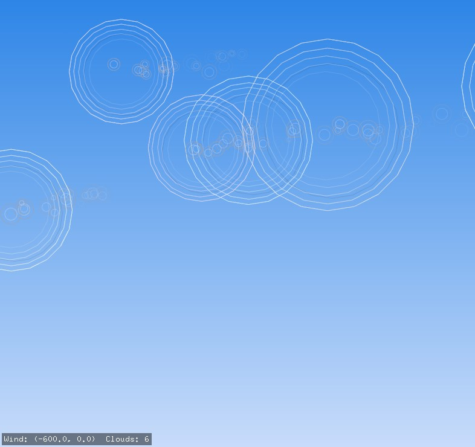
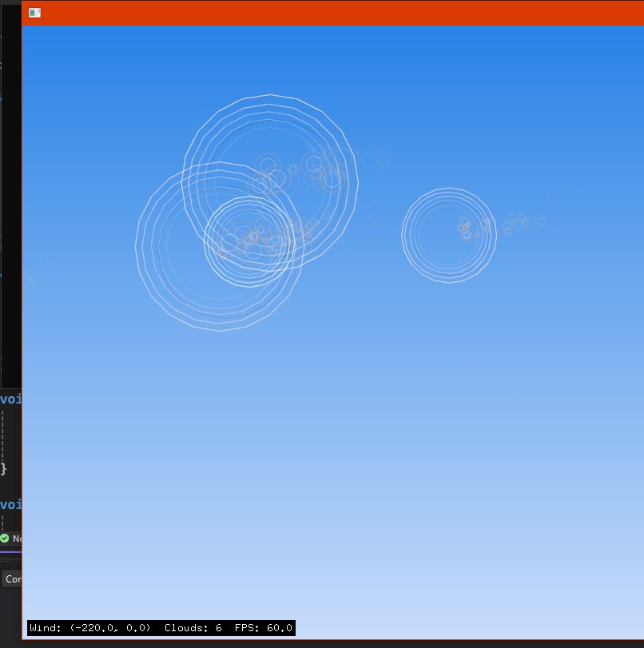
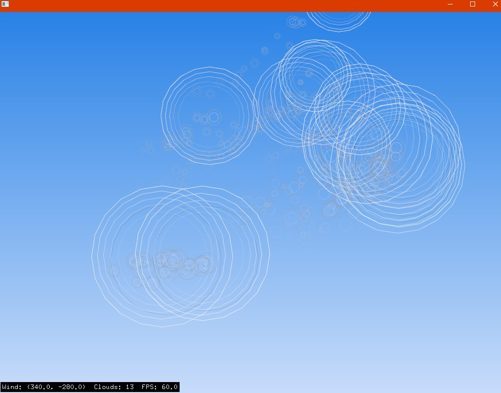
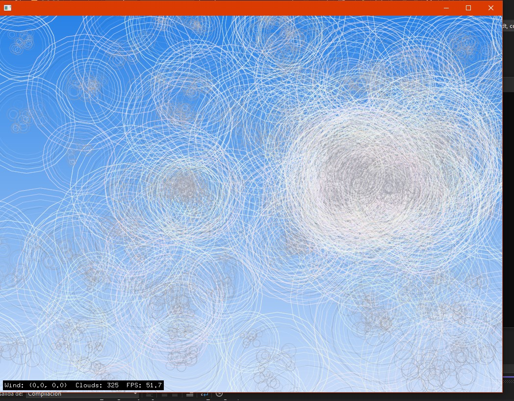
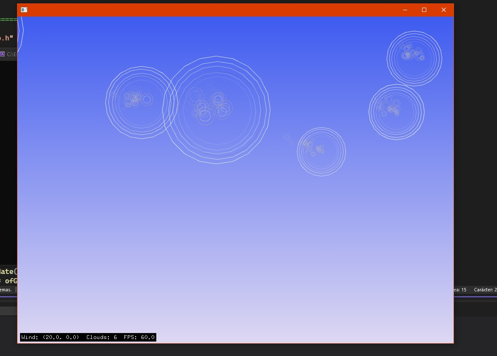

# Arte (Cielo Vivo)

La idea de mi obra es una simulación generativa de un cielo en movimiento, con nubes y humo gestionados por estructuras de datos como listas enlazadas y colas, que responde a la interacción del usuario con mouse y teclado, que al llegar al limite de la pantalla, se borran dinamicamente las nubes o al oprimir una tecla, otra idea que tengo para interacción con usuario es que haya un viento que mueva las nubes de dirección.


Las nubes se gestionan mediante una lista enlazada, donde cada nodo representa una nube con sus propias propiedades como color, posición y una pequeña estructura de  cola de humo asociada para que acompañe a las nubes. Esta estructura permite recorrer dinámicamente las nubes para actualizarlas, dibujarlas y, en caso de que abandonen el área visible de la pantalla, eliminarlas eficientemente para liberar memoria.

## Aprendizaje

#### Crear nubes


Cuando se le da click al mouse se crean nuevas nubes en la pos del mouse, las nubes se crean en una lista enlazada: std::list<Cloud> clouds; .

Relación con estructura: la nube es un nodo de lista enlazada (clouds.emplace_back(...)). Que en este caso cuando pregunte a la IA porque uso emplace_back y no push_back me dijo que crea el elemento directamente dentro de la lista y no tiene que crearlo y luego copiar y moverlo a la lista.

```cpp

//Para la lista de nubes
void ofApp::spawnCloud(ofVec2f p) {
	float r = ofRandom(40, 110);
	ofVec2f v(ofRandom(-10, 10), ofRandom(-6, 6));
	ofColor c = ofColor(ofRandom(220, 255), ofRandom(220, 255), ofRandom(220, 255), 220);
	clouds.emplace_back(p, v, r, c); // Valores del construcor : pos, velocidad, radio y color
}
//Funcion de Crear nube con mouse
void ofApp::mousePressed(int x, int y, int button) {
	
	spawnCloud({ (float)x, (float)y });
}

// En esta parte se hacen iteraciones en la lista enlazada de las nubes
for (auto i = clouds.begin(); i != clouds.end();) {
	i->update(dt, wind);

	//Aca las nubes se eliminan de la lista cuando salen de la pantalla
	if (i->isOffscreen(ofGetWidth(), ofGetHeight())) {
		i = clouds.erase(i);
	} else {
		++i;
	}
}
```
#### Cambio de viento con flechas



Cuando se presionan las flechas se le cambio el valor a la var wind en su respectiva dirección la cual causa que las nubes que esten en el lienzo reciba un update en su velocidad, que refleja este movimiento. Wind es un vector global (ofVec2f wind), cuando se recorre la lista enlazada de las nubes se pasa ese valor de wind en el nodo de cada una


```cpp
void ofApp::keyPressed(int key){
    float step = 20.0f;
    switch (key) {
        case OF_KEY_LEFT:  wind.x -= step; break;
        case OF_KEY_RIGHT: wind.x += step; break;
        case OF_KEY_UP:    wind.y -= step; break;
        case OF_KEY_DOWN:  wind.y += step; break;
    }
}

void update(float dt, const ofVec2f & wind) {

	vel += wind * dt * 0.2f; //El viento aplica en las nubes
	pos += vel * dt;
```
El update tiene más cosas, pero fui probando cada cosa pedazo a pedazo, para saber que si funcionaba correctamente y luego a medida, iba probando las demás y las iba agregando, esta parte es para aplicar el viento en las nubes. 

Ejemplo:

En este caso se mueven en -x, se aprecia mejor en el video, pero se ve por la pos de las particulas, abajo en wind sale hacia donde se estan moviendo.

Ejemplo 2: 

En este caso se mueven hacia arriba en el eje x positivo.


#### Cola de humo FIFO

La segunda estructura que utilice fue FIFO, en donde cada nube mientras se mueve tiene particulas de humo que se generan detras de cada nube.

Smoke es un std::deque<SmokeParticle> (cola). 

- emplace_back añade nuevas partículas al final, el emplace por recomendacion de la IA para mejora el funcionamiento de memoria.

- pop_front elimina las primeras particulas creadas cuando su vida llega a 0.

-  es un FIFO donde la primera que entra es la primera que sale.

```cpp

//(dentro de Cloud::update):

// generar partícula nueva con el constructor de smoke
smoke.emplace_back(pos, pvel, psize, life); //pos, velocidad, tamano y duracion de cada particula

// actualizar partículas
for (auto &p : smoke) p.update(dt);

// eliminar partículas viejas (FIFO) cuando la vida es menor
while (!smoke.empty() && smoke.front().life <= 0)
    smoke.pop_front();
```

- Aca esta la parte del update para el humo agregado a lo que hice arriba, lo agregue despues de crear el viento.

```cpp
void update(float dt, const ofVec2f & wind) {
	

	// Genera el humo periodicamente
	smokeTimer += dt;
	if (smokeTimer >= smokeInterval) {
		smokeTimer = 0;
		// El inicio de las particulas depende de la velocidad de las nubes
		ofVec2f pvel = vel * 0.2f + ofVec2f(ofRandom(-10, 10), ofRandom(-30, -10));
		float psize = radius * ofRandom(0.08f, 0.22f);
		float life = ofRandom(1.2f, 2.6f);
		smoke.emplace_back(pos + ofVec2f(ofRandom(-radius * 0.4f, radius * 0.4f), ofRandom(-radius * 0.2f, radius * 0.2f)), pvel, psize, life);
	}

	
	// Aca le pongo un limite en la cola de smoke, para que no se bajen tanto el rendimiento y se sature el programa
	const size_t maxSmoke = 120;
	while (smoke.size() > maxSmoke)
		smoke.pop_front();

```
La última parte me toco agregarla, debido a que sin una restricción el programa me iba demasiado lento por la cantidad de particulas que se iban generando.



Esta prueba fue para verificar el aproximado de cuantas nubes se pueden tener antes de que se empiecen a caer los fps y fueron por ahi 300 o menos, ya por los valor de 320 como en la imagen ya empiezan a caer el rendimiento del programa.

#### Variaciones visuales del cielo

Cuando se  presiona la tecla r cambia la paleta de colores del cielo para darle más dinamismo al programa.

Código para inicializar el cielo:

```cpp
void ofApp::setup() {
	ofSetFrameRate(60);
	ofBackgroundGradient(skyTop, skyBottom, OF_GRADIENT_LINEAR);
	lastTime = ofGetElapsedTimef();
}

```
Cómo funciona:

ofBackgroundGradient(skyTop, skyBottom, OF_GRADIENT_LINEAR); esta se va redibujar cada frame.

```cpp
case 'r':
    skyTop = ofColor(ofRandom(10,80), ofRandom(80,160), ofRandom(180,255));
    skyBottom = ofColor(ofRandom(180,240), ofRandom(200,245), ofRandom(230,255));
    break;

```
En este ya se encarga de volver a poner los diferentes colores random, para que se vea un cielo limpio, con polución, un cielo de noche,etc.

Ejemplo:

- Color inicial: 

- Color cuando se presiona r: 

#### Draw

```cpp

void ofApp::draw() {
	// Se redibuja la gradiente del cielo
	ofBackgroundGradient(skyTop, skyBottom, OF_GRADIENT_LINEAR);

	// Se dibujan las nubes y su respectivo hum
	for (const auto & c : clouds) {
		//Detras de las nubes
		ofPushStyle();
		ofNoFill();
		ofEnableBlendMode(OF_BLENDMODE_ALPHA);
		for (const auto & p : c.smoke) {
			float alpha = p.opacity() * 180.0f;
			float size = p.size;
			// la gradiente del radio con multiples circulos
			ofSetColor(160, 160, 170, (int)alpha);
			ofDrawCircle(p.pos, size);
			ofSetColor(220, 220, 230, (int)(alpha * 0.6f));
			ofDrawCircle(p.pos, size * 0.6f);
		}
		ofPopStyle();


		drawCloudShape(c);
	}

```
Esto seria para dibujar las nubes y su humo cuando se crea una.


## Video del programa

[Link del video](https://youtu.be/2FXq-fdESMo)