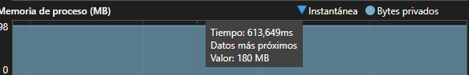

# Cielo Nocturno

La idea de mi obra es una simulación generativa de un cielo nocturno, donde diferentes formas representen las estrellas y aparecen de manera aleatoria, con  tamaños. Además, la idea es que haya una lluvia de cometas que aparezcan en cierta trayetoria y tengan un efecto de brillo con color.

Para la aplicacion de conceptos de POO en la obra, el encapsulamiento se lo utilizaria para atributo en las estrellas o los cometas, como su posición, tamaño y color. La herencia la aplicaria al definir una clase abstracta base, que representa cualquier entidad del cielo, y de la cual derivan clases específicas que tengan diferentes formas como estrellas o cometas, permitiendo compartir propiedades comunes y reutilizar código. Finalmente, el polimorfismo se emplea en la lógica principal de la obra al manejar todos los objetos visuales mediante un mismo tipo base, lo que permite recorrer una lista de objetos para el cielo y llamar a sus métodos sin necesidad de conocer su tipo exacto.

### Evidencias y conclusiones

Codigo.h

R/ En el .h definí la clase base CelestialObject que contiene los atributos en común como posición, tamaño y color, además de los métodos update() y draw() virtuales que luego se implementan en cada clase hija. Esto permite manejar tanto las estrellas como cometas bajo una misma interfaz. Luego, en las clases hijas, Star y Comet añadí sus comportamientos específicos:

Clase Padre:

```cpp
class CelestialObject {
protected:
	ofVec2f pos;
	float size;
	ofColor color;

public:
	CelestialObject(ofVec2f _pos, float _size, ofColor _color) {
		pos = _pos;
		size = _size;
		color = _color;
	}

	virtual void update() = 0;
	virtual void draw() = 0;
	virtual ~CelestialObject() { }
};
```
Ejemplo de atributo común en el padre:

glm::vec2 position;
float size;
ofColor color;


Las estrellas aparecen y desaparecen de forma sutil, usando una variable de opacidad.

```cpp
void Star::update() {
	time += speed;
	alpha = ofMap(sin(time), -1, 1, 30, 255);
}
```
EL alpha con el sen y el tiempo es el que permite que la opacidad cambie constantemente en las estrellas.

Los cometas heredan lo común, pero tienen un color cambiante y además dirección, para que se pueda invertir entre izquierda y derecha.

```cpp
Comet::Comet(ofVec2f _pos, ofVec2f _vel, float _size, ofColor _color)
	: CelestialObject(_pos, _size, _color) {
	velocity = _vel;
	hue = ofRandom(255);
```

Finalmente, en el ofApp.h incluí los vectores de objetos, así como las variables de control para los cometas como velocidad, cantidad y dirección, además de un contador para mostrar en pantalla junto con los FPS.

Codigo.cpp

```cpp
void ofApp::setup() {
	ofBackground(0);
	cometCount = 5;
	cometSpeedFactor = 1.0f;

	// Estrellas
	for (int i = 0; i < 100; i++) {
		objetos.push_back(new Star(
			ofVec2f(ofRandom(ofGetWidth()), ofRandom(ofGetHeight())),
			ofRandom(1, 4),
			ofColor(ofRandom(150, 255))));
	}

	// Cometas
	for (int i = 0; i < cometCount; i++) {
		float dirX = (ofRandom(1) > 0.5) ? ofRandom(2, 5) : -ofRandom(2, 5);
		objetos.push_back(new Comet(
			ofVec2f(ofRandom(ofGetWidth()), ofRandom(ofGetHeight() / 2)),
			ofVec2f(dirX, ofRandom(2, 5)),
			ofRandom(3, 6),
			ofColor(100, 200, 255)));
	}
}

```
R/ En el setup() inicializo el cielo generando un conjunto de estrellas y algunos cometas iniciales. Cada objeto se agrega al vector de punteros de tipo base (std::vector<std::shared_ptr<CelestialObject>>), lo que permite aprovechar el polimorfismo.

En update() hago lo siguiente:

Recorro todos los objetos y llamo su update(), esto hace que las estrellas cambien su opacidad para desaparecer y aparecer. Cabe destacar que tanto el comet y las estrellas heredaron el metodo update para modificarselo a cada uno.

Los cometas cambian de color y se mueven en la dirección definida, pudiendo rebotar o reiniciarse al salir de pantalla. En draw() dibujo el cielo y se recorre el vector de objetos y se llama a draw() polimórficamente.

Cometa: 

```cpp
void Comet::draw() {
	ofSetColor(color);
	ofDrawCircle(pos, size);

	for (int i = 1; i < 10; i++) {
		ofSetColor(color.r, color.g, color.b, 200 - i * 20);
		ofDrawCircle(pos - velocity * i, size - i * 0.3);
	}
}

```
Estrella:

```cpp
void Star::draw() {
	ofSetColor(color.r, color.g, color.b, alpha);
	ofDrawCircle(pos, size);
}
```

Además, en la esquina superior izquierda se muestran los FPS, la cantidad de cometas y su velocidad actual mediante ofDrawBitmapString.

En keyPressed() añadí un switch con teclas WASD,  para controlar los parámetros de los cometas:

```cpp
void ofApp::keyPressed(int key) {
	switch (key) {
	case 'w': // agregar cometa
	case 'W':
		cometCount++;
		{
			float dirX = (ofRandom(1) > 0.5) ? ofRandom(2, 5) : -ofRandom(2, 5);
			objetos.push_back(new Comet(
				ofVec2f(ofRandom(ofGetWidth()), ofRandom(ofGetHeight() / 2)),
				ofVec2f(dirX, ofRandom(2, 5)),
				ofRandom(3, 6),
				ofColor(100, 200, 255)));
		}
		break;

	case 's': // quitar cometa
	case 'S':
		for (int i = objetos.size() - 1; i >= 0; i--) {
			Comet * c = dynamic_cast<Comet *>(objetos[i]);
			if (c) {
				delete c;
				objetos.erase(objetos.begin() + i);
				cometCount--;
				break;
			}
		}
		break;

	case 'd': // aumentar velocidad
	case 'D':
		cometSpeedFactor *= 1.2f;
		for (auto & obj : objetos) {
			Comet * c = dynamic_cast<Comet *>(obj);
			if (c) c->scaleVelocity(1.2f);
		}
		break;

	case 'a': // disminuir velocidad
	case 'A':
		cometSpeedFactor *= 0.8f;
		for (auto & obj : objetos) {
			Comet * c = dynamic_cast<Comet *>(obj);
			if (c) c->scaleVelocity(0.8f);
		}
		break;
	}
}

```
### Ejemplos del programa 

Al correr el programa se ve de la siguiente manera:


#### Ejemplo de Cambios

Cuando se baja mucho la velocidad una parte de los cometas perderan su efecto de luz en la cola por perder velocidad y otros que seguiran apareciendo no se veran tan afectados por los cambios de velocidad:


Con diferente Cantidad de cometas:


El tope para que empezaran a caer los fps en mi computador fue despues de los 650 más o menos, ya desúes cada vez que seguia agregando cometas iban bajando cada vez más.


### Análisis de Memoria

Los objetos del cielo están almacenados en un std::vector<std::shared_ptr<CelestialObject>> skyObjects.
lo que significa que: El vector como tal vive en la pila stack. Los objetos Star y Comet viven en el heap, ya que se crean dinámicamente con std::make_shared.

Gracias a shared_ptr no hay problemas de fugas de memoria, ya que libera los recursos automáticamente cuando un objeto ya no se usa.

Las variables de control como cantidad de cometas, velocidad, dirección, etc. están en ofApp.h y son globales a la ejecución de la aplicación. Estas permanecen en memoria mientras el programa está corriendo.

#### Uso



Cuando estaba depurando el programa, cuando inicialice en draw los objetos con: for (auto & obj : objetos) {
	obj->draw();
}

Me de cuenta que el consumo de memoria en tiempo real de la aplicación,en ese instante, el programa estaba usando aproximadamente 180 MB de memoria RAM,  que probablemente en gran parte sea de las librerias que tiene el programa. Sin embargo, ese valor también podría incluir:

Instancias de objetos como Star y Comet, ya que cada objeto ocupa memoria por sus atributos (glm::vec2, float, ofColor, etc.). Como usamos un std::vector<std::shared_ptr<CelestialObject>>, cada objeto está en el heap, y el vector solo guarda punteros inteligentes.

Sobrecarga de shared_ptr:
A shared_ptr añade un pequeño bloque extra en memoria para mantener el conteo de referencias. Esto asegura que el objeto se destruya automáticamente cuando ya no se use, pero también significa que cada objeto usa algunos bytes adicionales.

Funciones virtuales y vtable:

Como la clase CelestialObject tiene métodos virtuales (update() y draw()), cada instancia guarda un puntero a su tabla virtual (vptr). Ese puntero ocupa memoria en cada objeto, generalmente del tamaño de un puntero, 4 u 8 bytes según la arquitectura. La vtable en sí está en una sola copia compartida, pero el vptr sí aparece en cada objeto.

Lo bueno es que no hay fugas graves de memoria, ya que el gráfico se mantiene constante en lugar de tener varios picos indefinidos.

### Link del Video al programa

[Link Del Video](https://youtu.be/CG6jemDrA4Y)


### Conclusiones 

- Experimentación

Probando el programa en Visual Studio con las herramientas de diagnóstico, se puede ver que el consumo de memoria es estable porque los objetos se manejan con std::shared_ptr, evitando fugas. El rendimiento es bueno ya que el update() y draw() de cada objeto son simples y no hay cálculos de muchos uso.

Impacto de POO en el rendimiento:
El uso de herencia y métodos virtuales introduce una ligera sobrecarga debido al uso de la vtable, pero en este caso el impacto es mínimo porque el número de objetos no es extremadamente grande y se agruparon atributos comunes en la clase base, evitando duplicación.

Alternativas que me dio chat para el rendimiento:

Si en algún momento el número de objetos creciera a miles o decenas de miles, se podría:

Reemplazar los métodos virtuales por un enfoque de component system o plantillas (CRTP) para eliminar la sobrecarga de la vtable.

Evitar shared_ptr y usar std::vector<Star> / std::vector<Comet> directamente, aunque se perdería parte del polimorfismo.

- Reflexión y ajuste final

Pruebas y ajustes:
Se realizaron pruebas de rendimiento con diferentes cantidades de cometas y estrellas. Incluso al aumentar bastante los objetos, el programa mantuvo un rendimiento estable y los FPS no cayeron significativamente sino alcanzar el número de más de 600 cometas es cuando empezaban a caer los FPS.

- Practicas de POO

Encapsulamiento: atributos protegidos y métodos públicos claros.

Herencia: una clase base abstracta para compartir lo común y especializar lo particular.

Polimorfismo: uso de métodos virtuales para tratar todos los objetos de manera uniforme, facilitando la escalabilidad.

Desafíos enfrentados:

- Lograr que las estrellas aparecieran y desaparecieran de manera fluida, ya que cuando le pedi a chat que me agregara esta parte no me generaba como lo tenían en mente hasta que logre que hiciera como se ve en el programa final.

- Manejar la dirección de los cometas y sus cambios de color en tiempo real.