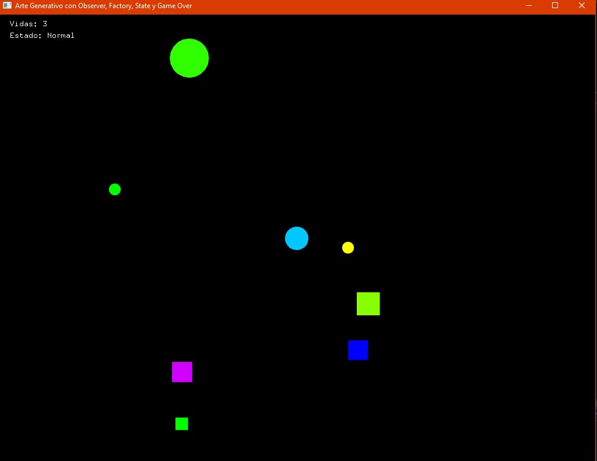
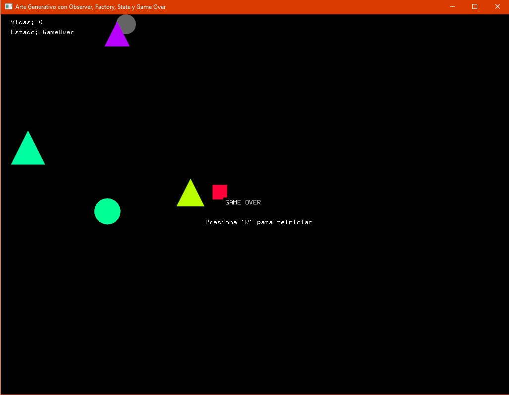
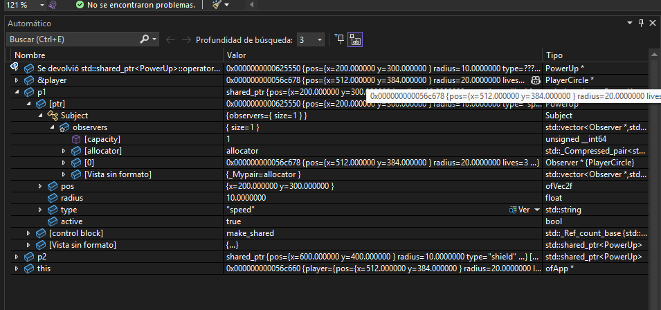
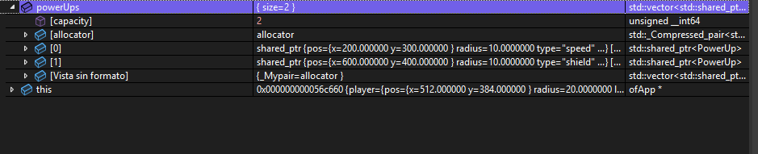
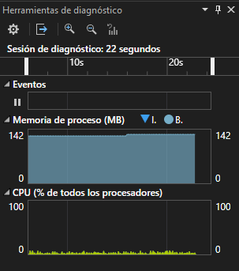

### Shapes and Shapes

El proyecto consiste en una experiencia  donde controlas un círculo  que puedes mover libremente por la pantalla. A medida que avanzas, aparecen diversas figuras geométricas enemigos generados dinámicamente que intentan colisionar contigo y causarte daño. Para sobrevivir, debes esquivarlas o aprovechar objetos especiales que, al recogerlos, te otorgan poderes temporales que modifican tu forma o habilidades. El círculo tiene tres vidas, y cada vez que recibe daño, su apariencia cambia para reflejar su estado de salud, mostrando visualmente cómo se debilita. 

### Aplicación de patrones de diseño en el arte generativo:

Patrón Observer: Se utiliza para gestionar los poderes especiales que el círculo puede obtener al recoger ciertos objetos. Cuando un poder se activa, todos los componentes relacionados (como la apariencia del círculo, la velocidad, o la interacción con enemigos) se actualizan automáticamente notificando a los observadores de ese cambio, asegurando una comunicación eficiente y desacoplada entre los elementos del juego.

Patrón Factory: Permite la creación flexible y modular de diferentes tipos de enemigos o figuras geométricas, cada una con comportamientos y apariencias distintas. Esto facilita la extensión del juego añadiendo nuevas formas sin modificar el código principal, promoviendo la escalabilidad y mantenibilidad.

Patrón State: Controla el estado actual del círculo en cuanto a sus poderes o nivel de salud. Por ejemplo, el círculo puede estar en estado normal, estado con poder activo, o estado débil después de perder vidas. Este patrón permite que el comportamiento y la apariencia del círculo cambien dinámicamente según el estado, simplificando la gestión de estados complejos y sus transiciones.


### Evidencias y conclusiones

#### Código.h

En el .h en el proyecto se aplicaron tres patrones de diseño principales Observer, Factory y State.

#### Patrón Observer

Se definen las clases Observer y Subject, que permiten la comunicación entre los objetos del juego.
El Subject notifica a todos los Observer cuando un evento ocurre (como activar un poder), sin que ambos dependan directamente uno del otro.

```cpp
class Observer {
public:
	virtual void onPowerUpActivated(std::string type) = 0;
};

class Subject {
protected:
	std::vector<Observer *> observers;

public:
	void addObserver(Observer * obs) { observers.push_back(obs); }
	void notifyPowerUp(std::string type) {
		for (auto obs : observers)
			obs->onPowerUpActivated(type);
	}
};
```

 Esto permite que el circulo que es el jugador reaccione automáticamente cuando un PowerUp se activa, sin que el power-up necesite saber cómo está implementado el jugador.

Ejemplo en PowerUp que hereda de Subject:

```cpp
class PowerUp : public Subject {
public:
	ofVec2f pos;
	float radius;
	std::string type;
	bool active;

	PowerUp(ofVec2f p, std::string t);
	void draw();
};
```

Cuando el jugador toca un power-up, este ejecuta:

p->notifyPowerUp(p->type);


Y el jugador, como observador, recibe esa notificación en:

```cpp
void PlayerCircle::onPowerUpActivated(std::string type) {
	if (type == "speed") speed = 8.0;
	if (type == "shield") changeState(std::make_unique<PowerState>());
}
```


#### Patrón Factory

Se aplica en la clase EnemyFactory, encargada de crear diferentes tipos de enemigos (círculos, cuadrados, triángulos) sin modificar el código principal.

```cpp
class EnemyFactory {
public:
	static std::shared_ptr<Enemy> createEnemy();
};


En el .cpp, la fábrica decide aleatoriamente qué enemigo crear:

std::shared_ptr<Enemy> EnemyFactory::createEnemy() {
	int r = ofRandom(3);
	std::shared_ptr<Enemy> e;
	if (r == 0)
		e = std::make_shared<Enemy>();
	else if (r == 1)
		e = std::make_shared<SquareEnemy>();
	else
		e = std::make_shared<TriangleEnemy>();
	e->pos = ofVec2f(ofRandomWidth(), ofRandomHeight());
	e->vel = ofVec2f(ofRandom(-2, 2), ofRandom(-2, 2));
	e->color = ofColor::fromHsb(ofRandom(255), 255, 255);
	e->size = ofRandom(20, 40);
	return e;
}
```

Gracias al patrón Factory, se pueden agregar nuevos tipos de enemigos en el futuro sin tocar la lógica principal. Solo creo una nueva clase y la añado en el Factory.

#### Patrón State

Este patrón se utiliza para manejar los estados del círculo jugador (normal, débil, con poder, invulnerable o game over), cada uno con su propio comportamiento de movimiento y apariencia.

```cpp

class CircleState {
public:
	virtual void update(class PlayerCircle * circle) = 0;
	virtual void draw(class PlayerCircle * circle) = 0;
	virtual std::string getName() = 0;
	virtual ~CircleState() = default;
};
```

Cada estado implementa su propia lógica:

```cpp
class PowerState : public CircleState {
	float timer = 0;
public:
	void update(PlayerCircle * circle) override;
	void draw(PlayerCircle * circle) override;
	std::string getName() override { return "Power"; }
};


El jugador guarda un std::unique_ptr<CircleState> y cambia dinámicamente de estado:

void PlayerCircle::changeState(std::unique_ptr<CircleState> newState) {
	state = std::move(newState);
}

```

El cambio de estado también controla cuándo el jugador es invulnerable o cuándo ocurre el Game Over.

### Código.cpp

En el .cpp se implementan los estados, la lógica de notificación y la creación dinámica de enemigos.

```cpp
void InvulnerableState::update(PlayerCircle * c) {
	c->move();
	timer += ofGetLastFrameTime();
	if (fmod(timer, 0.2f) < 0.1f) visible = !visible; // parpadeo visual
	if (timer > 3.0f) {
		if (c->prevStateName == "Weak")
			c->changeState(std::make_unique<WeakState>());
		else
			c->changeState(std::make_unique<NormalState>());
	}
}
```

Cada estado maneja su duración, efectos y visualización. Cada clase se encarga de su propia lógica.

El estado GameOver detiene el movimiento y muestra un texto en pantalla:

```cpp
void GameOverState::draw(PlayerCircle * c) {
	ofSetColor(100, 100, 100);
	ofDrawCircle(c->pos, c->radius);
}

//Y en 

ofApp::draw():

if (player.state->getName() == "GameOver") {
	ofSetColor(255, 0, 0);
	ofDrawBitmapStringHighlight("GAME OVER", ofGetWidth() / 2 - 60, ofGetHeight() / 2);
	ofDrawBitmapStringHighlight("Presiona 'R' para reiniciar", ofGetWidth() / 2 - 100, ofGetHeight() / 2 + 40);
}

```
-  Ejemplo del Patrón Factory:


En setup() se crean enemigos dinámicamente desde la fábrica:

```cpp
for (int i = 0; i < 5; i++)
	enemies.push_back(EnemyFactory::createEnemy());

```

El sistema no necesita saber qué tipo de enemigo se generará, simplemente pide uno al Factory.

- Ejemplo del Patrón Observer

Cuando un PowerUp se recoge dispara automáticamente onPowerUpActivated() en el jugador.:

```cpp
if (p->active && p->pos.distance(player.pos) < player.radius + p->radius) {
	p->notifyPowerUp(p->type);
	p->active = false;
}

```
 
### Programa

Al correr el programa, el jugador  puede moverse libremente y esquivar figuras enemigas. Cuando choca con un enemigo, pierde una vida y entra en estado invulnerable unos segundos. Si pierde todas las vidas, aparece un mensaje de Game Over y el jugador no puede moverse hasta presionar ‘R’ para reiniciar.




El jugador es el círculo azul, el poder de defensa es el círculo amarillo, el poder de velocidad es el círculo verde y los demás son los enemigos.

- Estado Game over




### Analisis de memoria


- Observadores





- Power Ups



- Memoria

