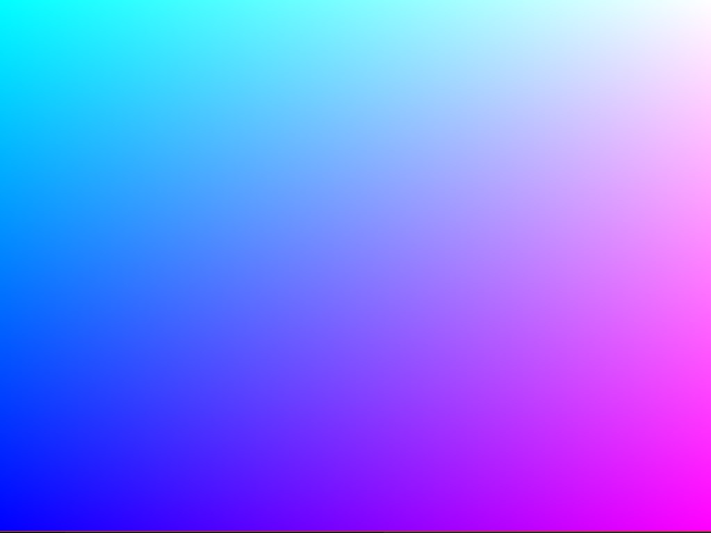
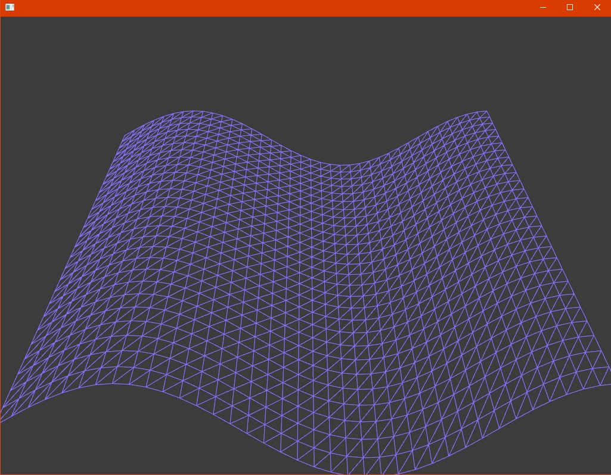
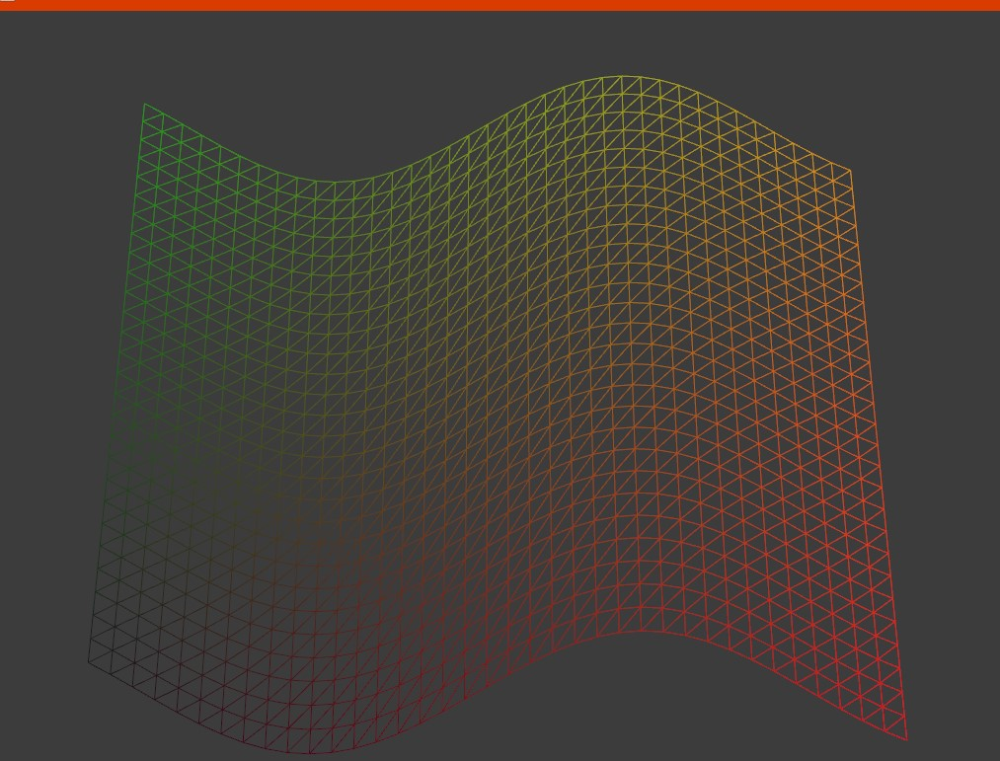
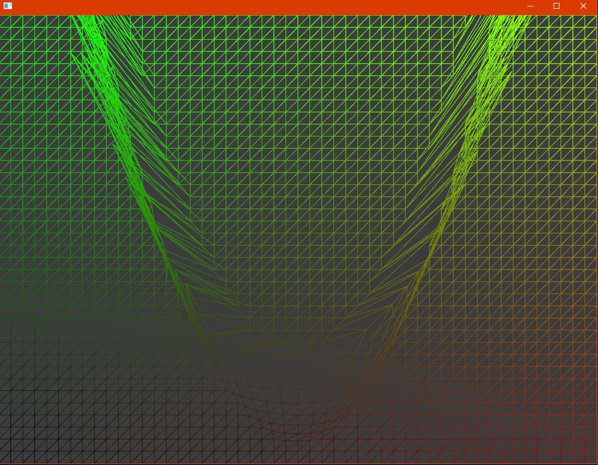
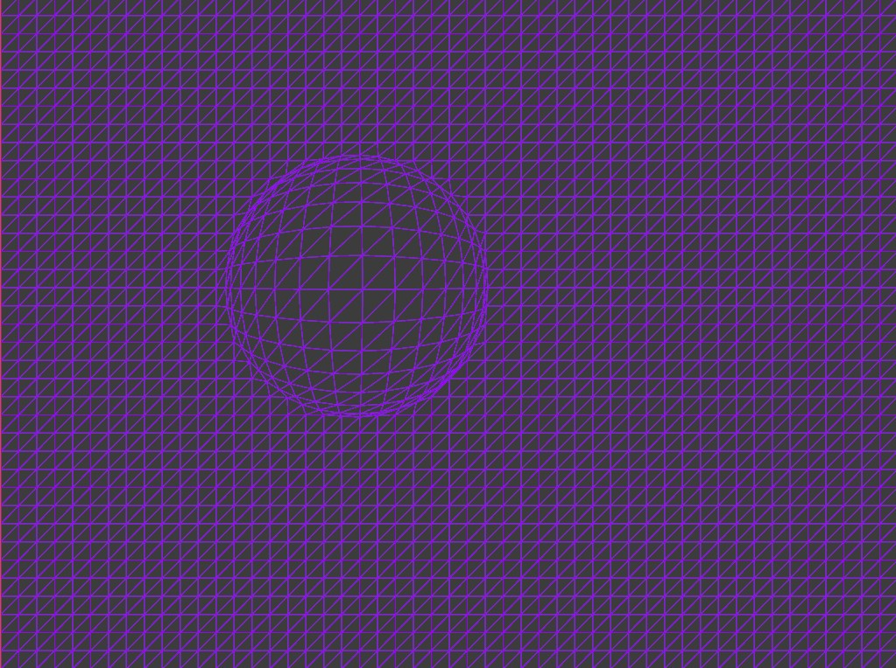
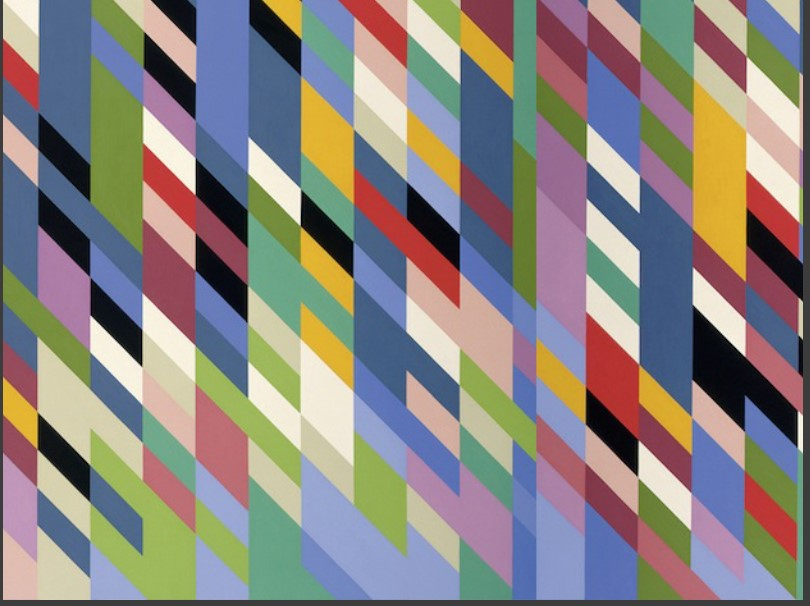
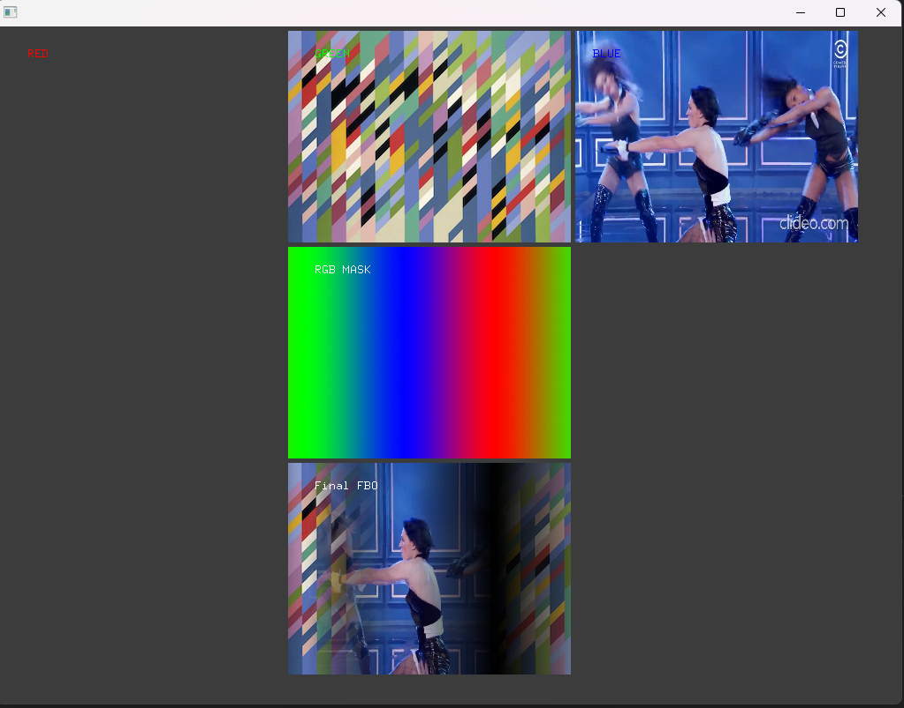

### Actividad 1

- ¿Qué son los vértices?

R/ Son puntos en el espacio 3D que definen la forma de un objeto.

- ¿Con qué figura geométrica se dibuja en 3D?

R/ Con triángulos.

- ¿Qué es un shader?

R/ Un shader es un programa que se ejecuta en la GPU y se utiliza para procesar la información de los vértices y fragmentos de una escena gráfica.

- ¿Cómo se le llaman a los grupos de píxeles de un mismo triángulo?

R/ Fragmentos.

- ¿Qué es un fragment shader?

R/ Un fragment shader es un programa que se ejecuta en la GPU y se utiliza para procesar la información de los fragmentos de una escena gráfica.

- ¿Qué es un vertex shader?

R/ Un vertex shader es un programa que se ejecuta en la GPU y se utiliza para procesar la información de los vértices de una escena gráfica.

- ¿Al proceso de determinar qué pixels del display va a cubrir cada triángulo de una mesh se le llama?

R/ Rasterización.

- ¿Qué es el render pipeline?


R/ El render pipeline es el proceso de renderizado de una escena gráfica, que incluye la generación de la geometría, la aplicación de shaders, la rasterización y la renderización de la escena.

- ¿Hay alguna diferencia entre aplicar un color a una superficie de una mesh o aplicar una textura?

R/ Sí, hay una diferencia entre aplicar un color a una superficie de una mesh y aplicar una textura. Al aplicar un color a una superficie, se utiliza un solo color para toda la superficie, mientras que al aplicar una textura se utiliza una imagen para representar la superficie, lo que permite una mayor variación en el aspecto visual de la superficie.

- ¿Cuál es la diferencia entre una textura y un material?


R/ Una textura es una imagen que se aplica a una superficie de una mesh para dar un aspecto visual más realista, mientras que un material es un conjunto de propiedades que se aplican a una superficie de una mesh, como el color, la reflectividad, la transparencia y la rugosidad.


- ¿Qué transformaciones se requieren para mover un vértice del 3D world al View Screen?


 R/ Se transforman en la GPU mediante el graphics pipeline: primero el vertex shader los proyecta de la cámara y luego al la pantalla; después, el rasterizador los convierte en fragmentos o píxeles, que el fragment shader colorea antes de enviarlos al framebuffer para mostrarse en pantalla.

- ¿Al proceso de convertir los triángulos en fragmentos se le llama?


 R/ A ese proceso se le llama rasterización . La rasterización toma triángulos y determina qué píxeles cubren, además de interpolar atributos como color, coordenadas UV y normales por fragmento.

- ¿Qué es el framebuffer?

 R/ El framebuffer es la memoria normalmente en la GPU donde se almacenan los valores finales que se mostrarán en pantalla. Incluye al menos el color buffer RGBA y suele complementarse con el depth buffer que es z-buffer, para evitar parpadeo al actualizar la pantalla.

- ¿Para qué se usa el Z-buffer o depth buffer en el render pipeline?


 R/ El Z-buffer guarda la profundidad de cada píxel ya rasterizado. Al procesar un nuevo fragmento se compara su profundidad con la del Z-buffer para decidir si el fragmento está más cerca y debe escribir su color, o si está detrás y debe ser descartado. E


### Actividad 2

- ¿Cómo funciona?

R/ openFrameworks carga los shaders de .vertex y .frag, y la GPU usa el código para transformar vértices y colorear píxeles.

- ¿Qué resultados obtuviste?


R/ Un degradado de color azul al magenta.

### Ejemplo 1



- ¿Estás usando un vertex shader?

R/ Sí, ya que con el begin y end estoy diciendo que use los shader que proporcione y transforma las posiciones de los vértices.

- ¿Estás usando un fragment shader?

R/ Sí, ya que con el begin y end estoy diciendo que use los shader que proporcione y calcula el color de cada píxel en función de su posición.

- Analiza el código de los shaders. ¿Qué hace cada uno?

shader.vert

```cpp
OF_GLSL_SHADER_HEADER

uniform mat4 modelViewProjectionMatrix;

in vec4 position;

void main(){
	gl_Position = modelViewProjectionMatrix * position;
}

```
 El shader.vert  transforma las posiciones de los vértices para que OpenGL sepa dónde dibujarlos en la pantalla.
 
 shader.frag

 ```cpp
OF_GLSL_SHADER_HEADER

out vec4 outputColor;

void main()
{
    // gl_FragCoord contains the window relative coordinate for the fragment.
    // we use gl_FragCoord.x position to control the red color value.
    // we use gl_FragCoord.y position to control the green color value.
    // please note that all r, g, b, a values are between 0 and 1.
    
    float windowWidth = 1024.0;
    float windowHeight = 768.0;
    
	float r = gl_FragCoord.x / windowWidth;
	float g = gl_FragCoord.y / windowHeight;
	float b = 1.0;
	float a = 1.0;
	outputColor = vec4(r, g, b, a);
}
```
  El shader.frag colorea los píxeles según su posición en pantalla.


  ### Ejemplo 2: Mover un plano y colores con los shaders

  - shader.vert

```cpp

OF_GLSL_SHADER_HEADER

// these are for the programmable pipeline system
uniform mat4 modelViewProjectionMatrix;
in vec4 position;

// the time value is passed into the shader by the OF app.
uniform float time;


void main()
{
    // the sine wave travels along the x-axis (across the screen),
    // so we use the x coordinate of each vertex for the calculation,
    // but we displace all the vertex along the y axis (up the screen)/
    float displacementHeight = 100.0;
    float displacementY = sin(time + (position.x / 100.0)) * displacementHeight;
	
    vec4 modifiedPosition = modelViewProjectionMatrix * position;
	modifiedPosition.y += displacementY;
	gl_Position = modifiedPosition;
}


```

- la pos Gl es lo que sale del archivo .vert, entonces al valor que hagamos igual glPosition, sera la pos de cada vertice en la pantalla, en este caso se uso sen para crear una especie de plano ondulado y para el mouse como no se necesita para cada vertice sino para cada draw() se guarda un valor uniforme.

- shader.frag

```cpp

OF_GLSL_SHADER_HEADER

uniform vec4 globalColor;

out vec4 outputColor;
 
void main()
{
    outputColor = globalColor;
}


```
- En este caso se usa un color uniforme debido a que no se necesita saber la posicion de cada vertice para cambiar de color, sino que se cambia por cada draw entonces se guarda esa pos y se cambia el color a todos los vertices en la pantalla.



### Actividad 3

- ¿Qué es un uniform?

R/ 	Una variable global enviada desde el CPU a la GPU, en este caso de OF a los shader y se llama asi Porque su valor es igual  para todos los vértices o fragmentos durante un draw(), se declara dentro del shader, con la palabra clave uniform.

- ¿Cómo funciona el código de aplicación, los shaders y cómo se comunican estos?


R/ Se comunica con los shadersa través de variables llamadas uniforms. El programa  activa el shader con shader.begin(), le envía datos como el color o la posición del mouse con setUniform(), y luego dibuja una figura. El vertex shader procesa la posición de cada vértice en pantalla, y el fragment shader determina el color de cada píxel. Así, la CPU define qué se dibuja y la GPU decide cómo se ve.

- Modifica el código de la actividad para cambiar el color de cada uno de los píxeles de la pantalla personalizando el fragment shader.

```cpp
OF_GLSL_SHADER_HEADER

uniform vec4 globalColor;

out vec4 outputColor;
 
void main()
{

float windowWidth = 1024.0;
float windowHeight = 768.0;

float r = gl_FragCoord.x / windowWidth;
float g = gl_FragCoord.y / windowHeight;
float b = 0.1;   
float a = 1.0;

outputColor = vec4(r, g * 0.7, b, a);

```
}

- Le añadí una modificacion como en el primer ejemplo, pero para que se vea color naranja.



### Ejemplo 3: Ahora usar la pos del mouse con uniforms

- shader.vert

```cpp

OF_GLSL_SHADER_HEADER

// these are for the programmable pipeline system
uniform mat4 modelViewProjectionMatrix;
in vec4 position;

uniform float mouseRange;
uniform vec2 mousePos;
uniform vec4 mouseColor;

void main()
{
    // copy position so we can work with it.
    vec4 pos = position;
    
    // direction vector from mouse position to vertex position.
	vec2 dir = pos.xy - mousePos;
    
    // distance between the mouse position and vertex position.
	float dist =  sqrt(dir.x * dir.x + dir.y * dir.y);
    
    // check vertex is within mouse range.
	if(dist > 0.0 && dist < mouseRange) {
		
		// normalise distance between 0 and 1.
		float distNorm = dist / mouseRange;
        
		// flip it so the closer we are the greater the repulsion.
		distNorm = 1.0 - distNorm;
		
        // make the direction vector magnitude fade out the further it gets from mouse position.
        dir *= distNorm;
        
		// add the direction vector to the vertex position.
		pos.x += dir.x;
		pos.y += dir.y;
	}

	// finally set the pos to be that actual position rendered
	gl_Position = modelViewProjectionMatrix * pos;
}
```
- En este caso para añadir la interactividad del mouse se hace a traves de los uniform, ya  que la posicion no cambia por vertice sino por draw() podemos pasar cierta cantidad de valores en el shader dependiendo de la funcion como por ejemplo:   shader.setUniform1f("mouseRange", 150); // SET A UNIFORM, el cual manda un solo valor, para pasar 2 se usa por ejemplo:  shader.setUniform2f("mousePos", mx, my);  // SET A UNIFORM, el cual manda dos valores de posicion, se pueden mandar 4 con un array, por ejemplo:    shader.setUniform4fv("mouseColor", &mouseColor[0]);  // SET A UNIFORM, el cual se logra con un puntero que apunte al primer valor en el array para saber la pos de los diferentes valores.

### Actividad 4

- ¿Qué hace el código del ejemplo?

R/ El ejemplo crea un efecto donde los vértices de un plano  se mueven del mouse cuando este se acerca. El color del plano también cambia gradualmente de magenta a azul dependiendo de la posición horizontal del mouse.

- ¿Cómo funciona el código de aplicación, los shaders y cómo se comunican estos?

R/ Se envian uniforms al shader sobre la posición del mouse, un rango de influencia (mouseRange) y un color (mouseColor). El vertex shader usa la posición del mouse para alterar la posición de los vértices, y el fragment shader usa el color pasado desde la aplicación para colorear el plano.

- Realiza modificaciones a ofApp.cpp y al vertex shader para conseguir otros comportamientos.

R/ // distance between the mouse position and vertex position.
	float dist =  sqrt(dir.x * dir.x + dir.y + dir.y * mouseRange);

 - Este fue un cambio que hice para que se vea diferente cuando el mouse se mueve.

 	ofFloatColor colorLeft = ofColor::orange;
	ofFloatColor colorRight = ofColor::green;

- Para cambiar los colores en of app

- Realiza modificaciones al fragment shader para conseguir otros comportamientos.


R/  outputColor = mouseColor * vec4(gl_FragCoord.x / 800.0, gl_FragCoord.y / 600.0, 1.0, 1.0);

Para una especie de degradado.






### Ejemplo 4: Texturas

- shader.vert

```cpp

OF_GLSL_SHADER_HEADER

// these are for the programmable pipeline system and are passed in
// by default from OpenFrameworks
uniform mat4 modelViewProjectionMatrix;

in vec4 position;
in vec2 texcoord;

// this is something we're creating for this shader
out vec2 texCoordVarying;

// this is coming from our C++ code
uniform float mouseX;

void main()
{
    // here we move the texture coordinates
    texCoordVarying = vec2(texcoord.x + mouseX, texcoord.y);

    // send the vertices to the fragment shader
	gl_Position = modelViewProjectionMatrix * position;
}


```
- el out vec2 textCoordVarying sirve para decirle al programa que bit de la textura ponerlo en forma de pixel en la pantalla mediante la interpolacion.

- shader.frag

```cpp

OF_GLSL_SHADER_HEADER

// this is how we receive the texture
uniform sampler2D tex0;
uniform vec2 resolution;

in vec2 texCoordVarying;

out vec4 outputColor;
 
void main()
{
    outputColor = texture(tex0, texCoordVarying / resolution);
}

```
- Como no se le da un nombre uniform aparece como text0 el sampler2D




### Ejemplo 5

- shader.frag

```cpp
OF_GLSL_SHADER_HEADER

uniform sampler2D tex0;
uniform sampler2D imageMask;

in vec2 texCoordVarying;

out vec4 outputColor;

void main()
{
    vec4 texel0 = texture(tex0, texCoordVarying);
    vec4 texel1 = texture(imageMask, texCoordVarying);
    outputColor = vec4(texel0.rgb, texel0.a * texel1.a);
}

```

- 


### Ejemplo 6


