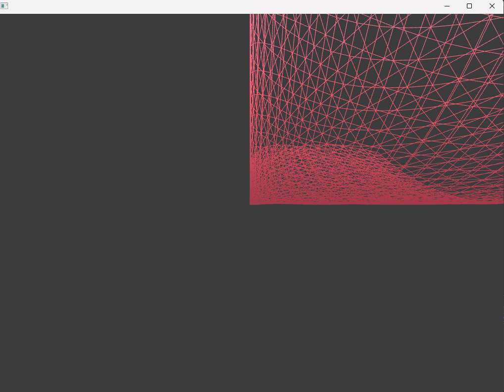
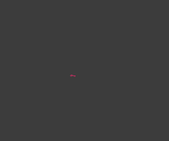
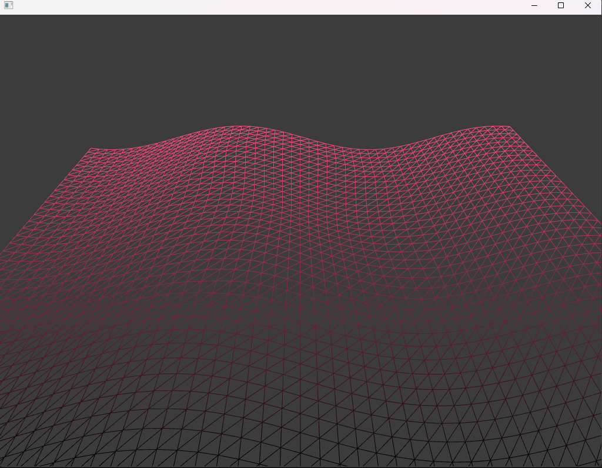

### Reto

- Tome la base del ejemplo 3 para haya como una distorsion en el mouse cuando se mueve, le cambio el degradado a los colores y agregue cosas del ejemplo 2 para que el plano se pueda ver tridimensional y se mueva con a onda sen.

#### Vertex

```cpp
OF_GLSL_SHADER_HEADER

// these are for the programmable pipeline system


uniform mat4 modelViewProjectionMatrix;
in vec4 position;
uniform float time;
uniform float mouseRange;
uniform vec2 mousePos;

void main()
{
    float displacementHeight = 100.0;
    float displacementY = sin(time + (position.x / 100.0)) * displacementHeight;

     vec4 modifiedPosition = modelViewProjectionMatrix * position;
	modifiedPosition.y += displacementY;

    vec4 pos = position;
    vec2 dir = mousePos - pos.xy; 
    float dist = distance(pos.xy, mousePos);

    if (dist > 0.0 && dist < mouseRange) {
        float distNorm = dist / mouseRange;
        distNorm = 1.0 - distNorm;
        dir *= distNorm * 0.5;
        pos.x += dir.x;
        pos.y += dir.y;
    }

    gl_Position = modelViewProjectionMatrix * pos + modifiedPosition;
}

```
- En la siguiente linea: gl_Position = modelViewProjectionMatrix * pos + modifiedPosition;,fue la que estuve mirando más de como agregar el modified position para que mueva la onda sen, ya que si lo multiplicaba pasaba esto:




Y si ponia la modifiedPosition más arriba el plano salia muy pequeño por el hecho de que ya es multiplicado por el modelViewProjectionMatrix, por lo que lo puse al final para que se sumara a la posicion y asi se moviera la onda sen, sin ningún inconveniente.




#### Frag

```cpp
OF_GLSL_SHADER_HEADER


out vec4 outputColor;
uniform vec4 mouseColor;
uniform vec2 mousePos;

void main()
{
   
    float factor = gl_FragCoord.y / 600.0;
    outputColor = vec4(mouseColor.rgb * factor, 1.0);
}


```


#### ofApp.cpp

```cpp
#include "ofApp.h"

//--------------------------------------------------------------
void ofApp::setup(){
	if(ofIsGLProgrammableRenderer()){
		shader.load("shadersGL3/shader");
	}else{
		shader.load("shadersGL2/shader");
	}

	int planeWidth = ofGetWidth();
	int planeHeight = ofGetHeight();
	int planeGridSize = 20;
	int planeColums = planeWidth / planeGridSize;
	int planeRows = planeHeight / planeGridSize;
	
	plane.set(planeWidth, planeHeight, planeColums, planeRows, OF_PRIMITIVE_TRIANGLES);
}

//--------------------------------------------------------------
void ofApp::update(){

}

//--------------------------------------------------------------
void ofApp::draw(){
	
	shader.begin();
	
	shader.setUniform1f("time", ofGetElapsedTimef());
	// center screen.
	float cx = ofGetWidth() / 2.0;
	float cy = ofGetHeight() / 2.0;
	
	// the plane is being position in the middle of the screen,
	// so we have to apply the same offset to the mouse coordinates before passing into the shader.
	float mx = mouseX - cx;
	float my = mouseY - cy;
	
	// we can pass in a single value into the shader by using the setUniform1 function.
	// if you want to pass in a float value, use setUniform1f.
	// if you want to pass in a integer value, use setUniform1i.
	shader.setUniform1f("mouseRange", 250);
	
	// we can pass in two values into the shader at the same time by using the setUniform2 function.
	// inside the shader these two values are set inside a vec2 object.
	shader.setUniform2f("mousePos", mx, my);
	
	// color changes from magenta to blue when moving the mouse from left to right.
	float percentX = mouseX / (float)ofGetWidth();
	percentX = ofClamp(percentX, 0, 1);
	ofFloatColor colorLeft = ofColor::magenta;
	ofFloatColor colorRight = ofColor::orange;
	ofFloatColor colorMix = colorLeft.getLerped(colorRight, percentX);
	
	// create a float array with the color values.
	float mouseColor[4] = {colorMix.r, colorMix.g, colorMix.b, colorMix.a};
	
	// we can pass in four values into the shader at the same time as a float array.
	// we do this by passing a pointer reference to the first element in the array.
	// inside the shader these four values are set inside a vec4 object.
	shader.setUniform4fv("mouseColor", mouseColor);
	
	ofTranslate(cx, cy);

	// the mouse/touch Y position changes the rotation of the plane.
	float percentY = mouseY / (float)ofGetHeight();
	float rotation = ofMap(percentY, 0, 1, -60, 60, true) + 60;
	ofRotateDeg(rotation, 1, 0, 0);

	plane.drawWireframe();
	
	shader.end();
}

//--------------------------------------------------------------
void ofApp::keyPressed(int key){
	
}

//--------------------------------------------------------------
void ofApp::keyReleased(int key){

}

//--------------------------------------------------------------
void ofApp::mouseMoved(int x, int y){
	
}

//--------------------------------------------------------------
void ofApp::mouseDragged(int x, int y, int button){

}

//--------------------------------------------------------------
void ofApp::mousePressed(int x, int y, int button){

}

//--------------------------------------------------------------
void ofApp::mouseReleased(int x, int y, int button){

}

//--------------------------------------------------------------
void ofApp::windowResized(int w, int h){

}

//--------------------------------------------------------------
void ofApp::gotMessage(ofMessage msg){

}

//--------------------------------------------------------------
void ofApp::dragEvent(ofDragInfo dragInfo){ 

}
 
```

